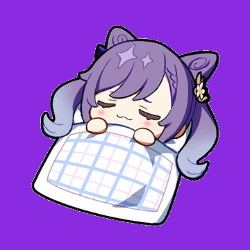
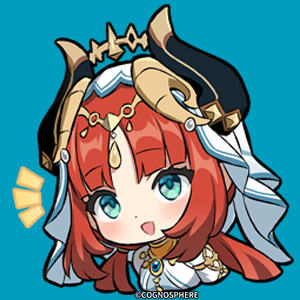
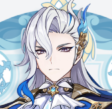
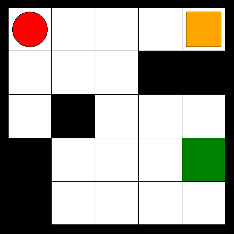

<h1 align="center">kaialex22
  

</h1>

<h2>⚡️Learning</h2>

  
  

<h2>🌱Research</h2>

<h2>
  
  Github
</h2>

<!--
**kaialex/kaialex** is a ✨ _special_ ✨ repository because its `README.md` (this file) appears on your GitHub profile.

Here are some ideas to get you started:

- 🔭 I’m currently working on ...
- 🌱 I’m currently learning ...
- 👯 I’m looking to collaborate on ...
- 🤔 I’m looking for help with ...
- 💬 Ask me about ...
- 📫 How to reach me: ...
- 😄 Pronouns: ...
- ⚡ Fun fact: ...
-->
